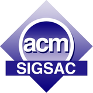

# Welcome to FEAST 2017

FEAST 2017 will be held in conjunction with the 24th ACM Conference on
Computer and Communications Security (CCS) on 03 November 2017.  The
workshop is geared toward discussion and understanding of several
critical topics surrounding software executable transformation for
improving the security and efficiency of all software used in
security-critical applications.  The scope of discussion for this
workshop will include topics that may be necessary to fully exploit
the power and impact of late-stage software customization efforts as
described in the Call for Papers.

## <i class="fa fa-newspaper-o"></i> News



## <i class="fa fa-calendar"></i> Important Dates



## <i class="fa fa-gg"></i> Sponsors

 
 
 

